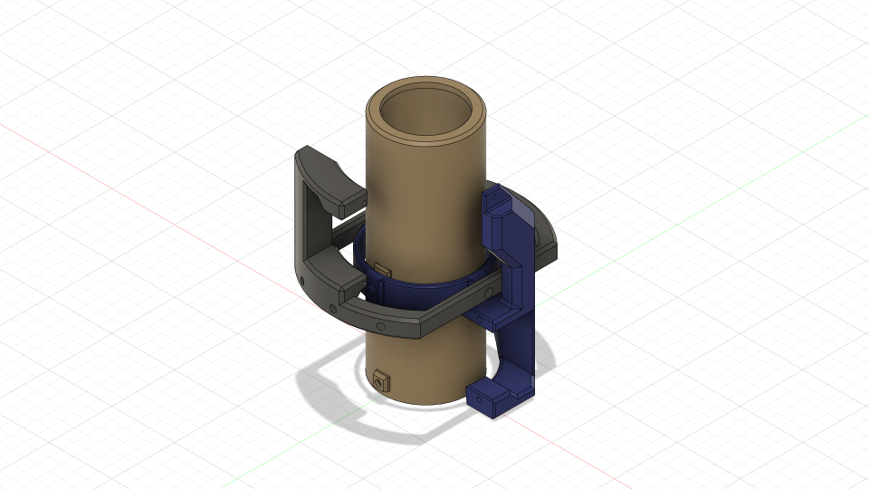
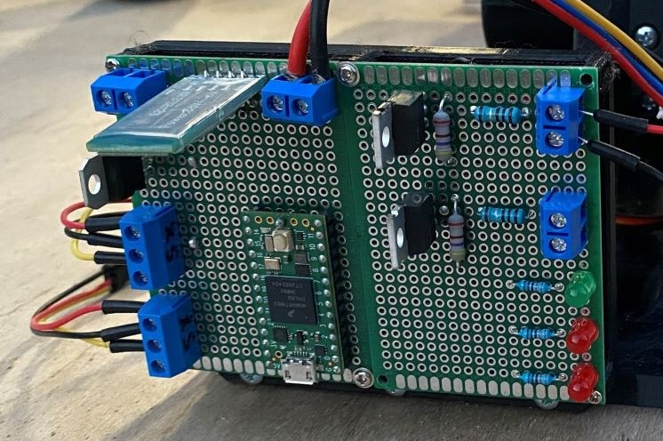
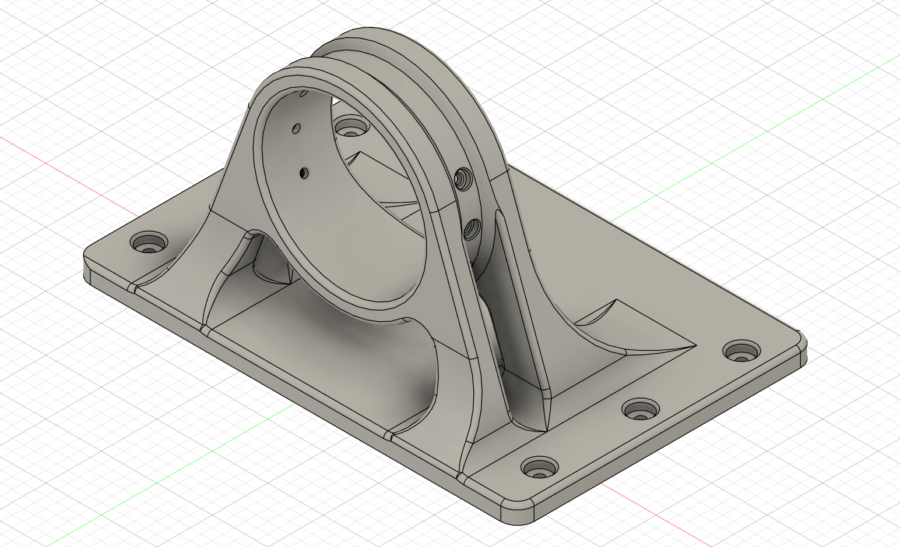

# TVC_Mount

This Repository contains informantion pertaining to the development and testing of a 3D-printed thrust-vector mount for a model rocket.

## About

I started this project in the summer of 2023 to learn more about rockets and how they can be controlled. After laying out the requirements for the mount (it must be able to hold 29mm motors, actuate +/- 6 degrees in the x and y, and fit in a 74mm airframe), I began to design using Fusion 360. Numerous iterations later, I found myself with a gimbaled mount looking something like the image below.

After printing and assembling, I designed and soldered a protoboard flight computer, which used the Teensy 4.0. The board had two pyro channels and two servo outputs (see below).

I then used this to create some rudimentary code that could be used during a static fire test of the mount, as well as a mount holder for static fire tests (see below).

Finally, I performed a [static fire test](https://www.youtube.com/watch?v=WfjEVA648XQ) to examine the structural integrity of the mount under load. The mount showed no signs of degradation, the protoboard worked perfectly (except for pyro channel 1, likely because of the MOSFET overheating), and the software worked perfectly, indicating the test was a success. Overall, I am extremely happy with how the project turned out, and I am excited to see how I can take it to the next level.
